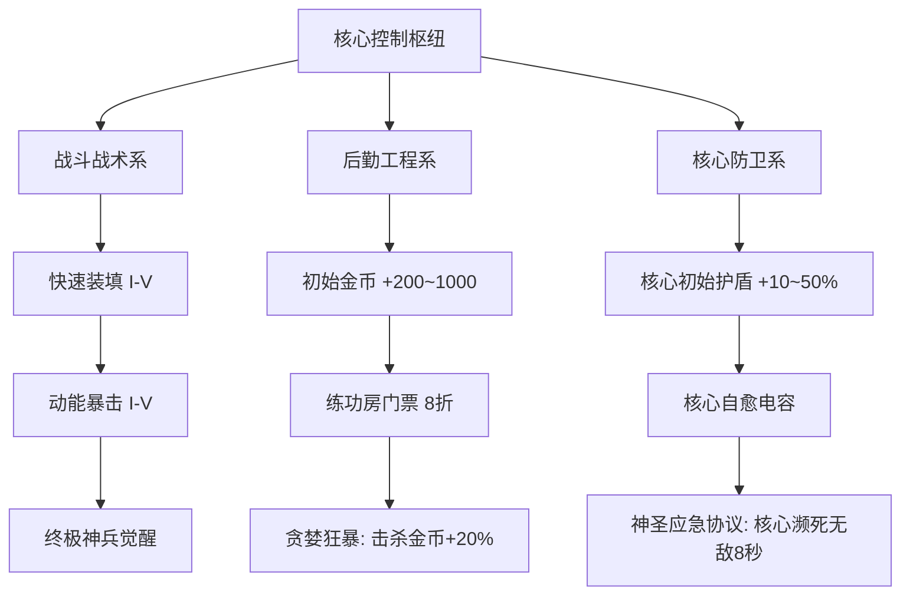

# 《零界防线：核心守卫》（Last Horizon: Core Protocol）
## UEFN 商业级游戏设计策划案 (GDD) 与叙事剧本

---

### 文档信息
* **项目代号**：GHYDN（守卫雅典娜现代化重构项目）
* **游戏公开发布名**：《零界防线：核心守卫》（英文：*Last Horizon: Core Protocol*）
* **平台**：Fortnite UEFN（全平台：PC / Console / Mobile）
* **游戏类型**：1~4人 合作PVE动作防守（Zero Build Co-op Action Defense）
* **推荐单局时长**：30 ~ 45 分钟（25~30波次）
* **商业目标**：契合 Epic Games Engagement Payouts 收益算法（超长单局停留 + 高次留/七留 + 短视频破圈裂变）

---

## 目录
1. [项目定位与核心设计哲学](#一项目定位与核心设计哲学)
2. [世界观与剧情脚本（叙事剧本）](#二世界观与剧情脚本叙事剧本)
3. [关卡动线与空间拓扑规划](#三关卡动线与空间拓扑规划)
4. [核心循环与 30 波关卡编排](#四核心循环与-30-波关卡编排)
5. [武器装备与局内合成体系](#五武器装备与局内合成体系)
6. [数值模型与动态平衡公式](#六数值模型与动态平衡公式)
7. [局外永久成长体系（Persistence API）](#七局外永久成长体系persistence-api)
8. [技术实现架构与 Verse 规范](#八技术实现架构与-verse-规范)
9. [避坑准则与性能预算约束](#九避坑准则与性能预算约束)

---

## 一、项目定位与核心设计哲学

### 1.1 核心体验三要素：防守 + 贪婪 + 救场
传统魔兽争霸《守护雅典娜》的成功密码并非来自于古旧的 RTS 点击操作，而是根植于**心理压迫与收益博弈的黄金三角**：
1. **防守焦虑（Anxiety）**：正面战场的怪物潮水般涌来，基地的血条在倒计时中脆弱不堪。
2. **贪婪渴望（Greed）**：练功房与高难 Boss 房提供数倍于主战场的收益，每一秒的停留都是战力暴涨的诱惑。
3. **高光救场（Heroics）**：在基地血量降至临界红线的瞬间，传送回城，手持终极神装，全屏大招清空战场。

《零界防线》将此循环完全升级为**现代虚幻5引擎的第三人称动作射击（TPS）**：
* 剔除“运水跑腿、复杂背板合成”等历史糟粕。
* 拥抱“丝滑身法跳跃、爆头暴击反馈、近战砸地重击、满屏光效割草”。

### 1.2 商业化与算法契合度
* **分均留存时间（Playtime）**：通过无死角的战斗、即时升级体验与紧凑的 60 秒出兵循环，杜绝垃圾等待时间，将单局有效留存锁死在 35~45 分钟的高价值收益区间。
* **次日/七日留存（Retention）**：利用 UEFN `Persistence API` 打造局外永久科技矩阵，通关或失败均有正向积累。
* **短视频裂变（Viral UA）**：高波次全屏弹幕、极光粒子爆发与“核心还剩 1% 血量时极限绝杀”的戏剧张力，天生具备 TikTok、YouTube Shorts 传播基因。

---

## 二、世界观与剧情脚本（叙事剧本）

### 2.1 世界观背景
公元 2184 年，地表空间出现未知的维度裂隙——“虚空之渊（The Void Rift）”。异界生物与硅基感染体如同瘟疫般吞噬各大大陆。
人类最后的生还者在大裂谷建立了一座坚固要塞，以代号**“零号矩阵（Matrix Zero / 能量核心）”**的人工奇点反应堆为能源，维持着保护全人类避难所的高维电磁穹顶。

能量核心不仅在供能，还在进行着一项长达 30 阶段的“虚空编码净化解析”。一旦核心被摧毁，防线即刻崩塌；若完成 30 阶段解析，净化脉冲将彻底封印虚空之渊。

### 2.2 核心角色与声优台词设定
* **战术指挥 AI ——“赫拉”（HERA）**：冷静、精准、带有一丝毒舌的要塞主控人工智能（负责全局语音、波次倒计时、警报广播）。
* **玩家小队**：代号“幽灵游侠（Ghost Rangers）”的机动特工，身负超导动能装甲。

### 2.3 剧本流程与全局台词演出表

| 阶段 | 波次 | 剧情事件 / 广播台词 | 战场氛围表现 |
| :--- | :--- | :--- | :--- |
| **序幕** | 开局 0s | **HERA**：*“特工接入完毕。警告：检测到虚空引力波暴涨，第一波跳虫群将在 30 秒后破门！拔出你们的武器，誓死捍卫零号矩阵！”* | 阳光斜照，警报黄光闪烁，武器终端自动解锁基础蓝枪 |
| **P1: 前哨遭遇** | Wave 1~6 | **HERA (W3)**：*“防线稳固。练功房维度折跃门已解锁，想要更强的火力？自己去里面抢，但记住——别死在贪婪里。”* | 白昼转为阴云，四向出怪口开始冒出紫色暗物质烟雾 |
| **P2: 暗影异化** | Wave 7~14 | **HERA (W10)**：*“高能反应！虚空刺客已隐匿突入！警报：核心受到未知远程狙击，回防！立刻回防！”* | 暴雨倾盆，天空中出现巨型虚空裂隙球体，雷电交加 |
| **转折: 补给狂欢** | Wave 15 | **HERA**：*“拦截到虚空补给运输艇！全员注意：30秒内击毁它们，所有打捞物资归你们私有！”* | 欢快的警报声，金色机械鸟与宝箱怪全图飞奔，满地金币 |
| **P3: 钢铁危局** | Wave 16~22 | **HERA (W18)**：*“攻城行者正在向核心发射重力塌缩弹！防护罩已过载！我们需要终极神装，谁去拿下 Boss 房的首级？！”* | 地面剧烈震颤，天空裂开猩红血色，全屏重金属战歌渐起 |
| **P4: 终焉裁决** | Wave 23~29 | **HERA (W25)**：*“它们不是来进攻的，它们是在执行湮灭协议！核心自愈系统已瘫痪，这是最后一搏！”* | 全图电磁干扰雪花屏，防线建筑残破，火光冲天 |
| **终章: 虚空领主** | Wave 30 | **虚空领主 (深沉混音)**：*“微不足道的火种……终将归于寂灭。”*<br>**HERA**：*“解析进度 99%！特工们，把所有的弹药倾泻在它脸上！为了人类！”* | 巨型 Boss 降临中场，天空雷暴狂涌，神装特效全面交织 |
| **胜利尾声** | 通关 | **HERA**：*“净化脉冲已激活……裂隙闭合。干得漂亮，游侠们。今晚，地表重归人类。”* | 刺目的白色净化光芒席卷全图，黎明破晓，全屏慢动作结算 |

---

## 三、关卡动线与空间拓扑规划

```
                             [ 北路：高攻重甲走廊 (宽阔/防坦) ]
                                            │
                                            │
          [ 西北：神器挑战圣所 ]              │              [ 东北：终极聚变房 ]
                 ↖                          │                          ↗
                   ┌────────────────────────┴────────────────────────┐
[ 西路：迅捷裂隙 ] ──┤                                                 ├── [ 东路：自爆蛛潮 ]
                   │            中央核心圣域（Safe Zone）             │
                   │                                                 │
                   │   [ 自动防御塔 ]    [ 零号矩阵核心 ]   [ 军备终端 ]  │
                   │                                                 │
                   └────────────────────────┬────────────────────────┘
                 ↙                          │                          ↘
          [ 西南：1~4号镜像练功房 ]           │              [ 东南：稀有晶石房 ]
                                            │
                                            │
                             [ 南路：主力突击走廊 (多高低台) ]
```

### 3.1 空间区域尺寸与规格参数
1. **中央核心圣域（$40\text{m} \times 40\text{m}$ 平方区域）**：
   * **中心**：零号矩阵核心（高约 6 米的悬浮发光聚变晶体，附带实体碰撞与环形护盾粒子）。
   * **东侧**：武器锻造终端（互动生成商店 UI）。
   * **西侧**：核心工程控制台（维修核心血量、升级全局护盾、雇佣无人机哨塔）。
   * **四个角落**：折跃传送门（带全息文字标识与当前开启状态）。
2. **四向行进走廊（出兵线）**：
   * **走廊长度**：$80\text{m} \sim 100\text{m}$（普通怪行走时间约 18~22 秒，迅捷怪约 12 秒）。
   * **地形设计**：
     * **北路**：开阔平原，伴随废弃卡车作为轻掩体，适合狙击与远程扫射。
     * **南路**：多层阶梯与断桥，适合霰弹枪拐角卡点与高空近战跳劈。
     * **西路**：狭窄通道，适合榴弹与穿透武器聚怪 AOE。
     * **东路**：有电磁减速带（可消耗金币激活），专克自爆怪。
3. **隔离资源区（练功房与 Boss 房）**：
   * 位于主地图外 500 米高空或地底深处，完全阻隔主战场的视距与音频碰撞，确保绝对性能独立。
   * **练功房（4间独立镜像）**：$20\text{m} \times 20\text{m}$ 靶场，四周不可破坏金属墙，中央刷怪点以 1.5 秒/只的超高频率刷新高赏金假人怪。

---

## 四、核心循环与 30 波关卡编排

### 4.1 核心驱动闭环
```
  ┌─────────────────────────────────────────────────────────────┐
  │                        正面防守清理杂兵                      │
  │                      （获取基础金币与通关积分）              │
  └──────────────┬───────────────────────────────▲──────────────┘
                 │ 攒够门票                      │ 警报拉响 / 45s倒计时结束
                 ▼                               │ 紧急回援救场
  ┌──────────────────────────────┐ 获得材料与巨款 ┌──────────────┴──────────────┐
  │     进入练功房 / 单挑Boss    ├──────────────▶│  武器一键升阶 / 激活神器被动 │
  │    （争分夺秒，45秒强制回传） │               │ （火力几何级数暴涨，全屏割草）│
  └──────────────────────────────┘               └─────────────────────────────┘
```

### 4.2 30 波关卡详细参数规划表

| 波数 (Wave) | 敌军配置代码 | 单怪特性与机制 | 团队策略焦点 | 达标装备门槛 |
| :---: | :--- | :--- | :--- | :--- |
| **W1~W3** | 虚空爬虫 (Crawler) | 纯近战，慢速，血薄 | 熟悉走位，测试枪感 | 蓝色初始 AR |
| **W4~W6** | 疾行猎犬 (Stalker) | 移速极快，尝试绕过玩家直接扑咬核心 | 优先清理近身漏怪 | 紫色 AR / 强化+2 |
| **W7~W9** | 剧毒发射体 (Spitter) | 远距离抛射酸液圈，造成区域持续减伤 | 狙击手定点爆头清除 | 金色突击步枪 |
| **W10 (Boss)**| **暴食巨兽·格鲁特** | 高额霸体护盾，跳跃震地冲击波 | 两人拉仇恨，两人集火后背弱点 | 解锁首把 T2 高爆武器 |
| **W11~W14** | 虚空自爆蛛群 | 死亡后 1.5 秒延迟核爆，伤害殃及队友和核心 | 严禁近身，必须中远距离引爆 | 必须配备大弹匣轻机枪 |
| **W15 (Bonus)**| **黄金补给船队** | 无攻击力，全图逃窜，击杀掉落大量金币与强化石 | 狂欢割草，全员刷钱 | 任意 |
| **W16~W19** | 攻城行者 (Siege Mech)| 仅对核心感兴趣，发射远程激光炮（核心伤害 300%）| 必须前压至走廊入口截杀 | T2 满强化武器 |
| **W20 (Boss)**| **暗影织网者·塞西尔** | 周期性全图致盲，并在核心周围召唤自爆幼卵 | 一人回防护核心，其余人集火破盾 | 诞生第一把 T3 终极神兵 |
| **W21~W24** | 虚空重装禁卫 | 携带正面防暴力场盾，仅背部受全额伤害 | 团队十字交叉夹角射击 | 双人 T3 神装配合 |
| **W25 (Bonus)**| **次元窃贼大暴走** | 快速闪烁移动的宝箱怪 | 最后一轮经济狂欢 | - |
| **W26~W29** | 湮灭混编军团 | 词条怪（全图冰冻光环、狂暴反伤、死亡吸血） | 容错极低，全技能轰炸 | 全员 T3 神装 + 核心满级护盾 |
| **W30 (Final)**| **终局领主·零界裁决者** | 三阶段变换：全屏雷暴、分身幻影、全屏秒杀充能 | 配合控制链打断吟唱，全图极限协同 | 神器大招交替轰炸 |

---

## 五、武器装备与局内合成体系

### 5.1 阶梯进阶树（Tier Progression）
```
[T1 基础武器] ──(强化+1~+5)──▶ [T2 进阶武器] ──(融入Boss核心素材)──▶ [T3 终极神魔异宝]
（蓝/紫色常规模拟枪械）       （金色科幻能量枪/附带AOE）          （全屏特效质变武器）
```

### 5.2 核心神兵矩阵与被动机制

| 武器名 | 武器定位 | 基础弹药/手感 | 核心质变被动 (Verse 驱动) | 视觉/音效反馈 |
| :--- | :--- | :--- | :--- | :--- |
| **雷神之怒 (Mjolnir AR)** | 链式连击步枪 | 高射速中口径 | 每次命中触发**“连环电弧”**，在 12 米内最多跳跃 5 个目标，造成 40% 溅射电伤。 | 刺目的蓝白色高压闪电粒子，伴随清脆雷鸣 |
| **地狱火重炮 (Hellfire Heavy)** | 战术高爆霰弹 | 4发泵动近战 | 开火喷射铝热燃烧弹，在着火区域留下**“烈焰风暴”**，持续灼烧造成减速与破甲。 | 金红色熔岩地面粒子，怪物身上附着火焰 |
| **虚空挽歌 (Singularity Bow)** | 战术重弓 | 蓄力贯穿射击 | 满蓄力箭矢在命中终点生成**“微型黑洞”**，聚拢周围 8 米内所有非霸体怪物并引爆。 | 空间扭曲着色器特效，深紫色重力坍缩冲击波 |
| **风暴使者之刃 (Zephyr Blade)** | 近战动能大剑 | 挥砍与重砸 | 右键消耗能量释放**“环形剑气旋风”**，击退所有怪群并立刻回满自身 25% 护盾。 | 炫目的风刃拖尾与地面碎石炸裂 |

### 5.3 辅助与消耗终端
* **战术兴奋剂（Adrenaline Injector）**：10秒内移速提升 50%，换弹速度翻倍（100金币）。
* **核心纳米维修包（Repair Nanites）**：立刻恢复核心 5,000 点生命值，全队 CD 90 秒（500金币）。
* **轨道电磁轨道炮（Orbital Strike）**：标记一个走廊，3秒后彻底毁灭该走廊所有非 Boss 目标（2,000金币，单局限用 2 次）。

---

## 六、数值模型与动态平衡公式

### 6.1 怪物成长指数曲线
为兼顾前期爽快割草与中后期高压博弈，采用复利增长模型：

$$\text{HP}_W = 200 \times (1.22)^{W-1} \times S_p$$
$$\text{ATK}_W = 15 \times (1.16)^{W-1} \times S_p$$

其中 $W$ 为当前波数（$W \in [1, 30]$），$S_p$ 为**玩家人数动态缩放系数**。

#### 动态弹性难度修正表 ($S_p$)

| 玩家人数 | 生命缩放 ($S_p^{\text{HP}}$) | 怪物数量缩放 ($S_p^{\text{Count}}$) | 金币收益修正 | 设计初衷 |
| :---: | :---: | :---: | :---: | :--- |
| **1 人 (独狼)** | **0.55** | **0.60** | **1.35x** | 保证单人玩家不会被多路分兵拆家秒杀，单局可单通 |
| **2 人 (双排)** | **0.80** | **0.85** | **1.15x** | 两人可以明确分工（一人守家，一人刷钱） |
| **3 人 (三人)** | **1.00** | **1.00** | **1.00x** | 基准设计数值 |
| **4 人 (满员)** | **1.25** | **1.25** | **0.90x** | 逼出最密集的满屏怪潮，强调全员配合与火力压制 |

### 6.2 核心防御容错公式
* **核心基础生命**：$30,000$ 点。
* **核心基础护盾**：$10,000$ 点（脱战 10 秒后以 500点/秒 恢复）。
* **无人防守崩溃临界**：在任意标准波次中，若一整条走廊的怪潮（约 8~12 只）完全接触核心：
  $$\text{TTD} (\text{Time to Death}) = \frac{30,000}{\sum \text{ATK}_W \times \text{AttackSpeed}} \approx 14 \sim 18\text{秒}$$
  *此数值严格锁死在“练功房玩家看见红光警报后，有 10 秒左右心理决策期，传送回城需 2 秒，落地开大救场需 3 秒”的黄金救场时间窗内。*

### 6.3 玩家续航平衡
* **移除无脑吸血**：为了防止后期玩家站撸无敌，全面采用**“行为激励式续航”**：
  * **爆头 / 弱点射杀**：立即恢复自身 5% 护盾。
  * **散弹 / 近战重击击杀**：怪物必定爆出**“动能补给球”**，拾取为自身及 5 米内友军回复 10% 护盾与 15 点体力。

---

## 七、局外永久成长体系（Persistence API）

### 7.1 矩阵点数（Matrix Points）结算机制
玩家无论通关还是守家失败，都会根据表现获得永久资产：
$$\text{Matrix Points} = (\text{Cleared Waves} \times 10) + (\text{Elite Kills} \times 5) + (\text{Victory Bonus: } 200)$$

### 7.2 局外天赋矩阵（Matrix Tech Tree）



### 7.3 Verse 持久化数据安全结构
为了防止网络抖动导致的持久化回档或内存溢出，采用高紧凑性数据封装：

```verse
# 局外存档持久化类
player_persistence_data := class<persistable>:
    # 基础资产
    MatrixPoints : int = 0
    TotalClears : int = 0
    
    # 天赋等级字典压缩为单一整型数组 (Bit/Index Mapping)
    # [0]=初始金币, [1]=核心护盾, [2]=暴击率, [3]=装填速度, [4]=紧急无敌
    TalentLevels : []int = array{0, 0, 0, 0, 0}
    
    # 解锁的外观或称号标识
    UnlockedBadges : int = 0
```

---

## 八、技术实现架构与 Verse 规范

### 8.1 整体架构设计（模块解耦）
```
                        ┌───────────────────────────────┐
                        │     Game_Manager.verse        │
                        │    (全局主控 / 状态机调度)     │
                        └───────┬───────────────┬───────┘
                                │               │
          ┌─────────────────────┴──┐         ┌──┴──────────────────────┐
          ▼                        ▼         ▼                         ▼
┌──────────────────┐    ┌──────────────────┐ ┌──────────────────┐ ┌──────────────────┐
│ Wave_Controller  │    │   Core_Health    │ │  Teleport_Gate   │ │  Weapon_Forge    │
│ (怪潮生成/AI寻路) │    │ (核心血量与警报) │ │ (门票/45s限时)   │ │ (升阶合成/技能)  │
└──────────────────┘    └──────────────────┘ └──────────────────┘ └──────────────────┘
```

### 8.2 核心模块实现细节

#### 1. 练功房超时与强制召回（`Teleport_Gate`）
* 玩家在传送门按交互键 -> 扣除门票金币。
* 记录当前玩家 `agent`，启动内部协程：
  ```verse
  # 45秒倒计时协程
  RunRoomTimer(Player : agent)<suspends> : void =
      race:
          block:
              Sleep(45.0)
              ForceRecall(Player, "时间耗尽！强制折跃回城！")
          block:
              # 监听核心濒死事件，若拉响红色警报，提示玩家可主动按键回城
              AwaitEmergencyRecall(Player)
          block:
              # 监听玩家主动离开
              AwaitPlayerExit(Player)
  ```

#### 2. 核心受击与警报联动（`Core_Health`）
* 核心受到伤害时，触发动态声光效果：
  * **血量 < 40% (黄色警报)**：全局低频警报音效，顶部 HUD 闪烁黄光。
  * **血量 < 15% (红色绝境)**：全图变暗，警报鸣响，屏幕四周覆盖红光脉冲，向所有在练功房的玩家屏幕正中弹出醒目大字：**【警告：能量核心即将过载崩溃，立刻回防！】**。

---

## 九、避坑准则与性能预算约束

### 9.1 版权红线绝对隔离
* **严禁**：使用“雅典娜”、“圣斗士”、“小宇宙”、“天马流星拳”等暴雪、集英社等第三方商标与专有名词。
* **推荐**：完全采用科幻/赛博废土叙事（“零号矩阵”、“虚空之渊”、“超导晶体”、“幽灵游侠”）。这不仅能顺利通过 Epic 商业审核，还更容易受到欧美主流 Fortnite 玩家的喜爱。

### 9.2 内存配额与同屏实体控制（100k 内存上限）
Fortnite 对活动 NPC 数量有严格的服务器性能惩罚（Server Tick Rate）：
1. **怪物同屏上限**：严格控制在 **40~60 只以内**。当场上怪物达到上限时，生成器暂时挂起，直至有怪被消灭再补齐。
2. **拒绝盲目堆怪**：
   * 用**“体型变大 1.5 倍 + 红色高亮边框 + 附带自爆词条”**的精英怪，代替原本需要 20 只小怪才能提供的压迫感。
3. **粒子特效控制**：Niagara 特效的生命周期严格控制在 1.5 秒以内，严禁全图残留粒子造成 Switch 或旧世代主机掉帧。

### 9.3 零长篇教学（前 30 秒流失防范）
* **禁止任何遮挡视线的弹窗教程**。
* 玩家出生在正中央，眼前是巨大的霓虹倒计时浮空字：
  **“30 秒后第一波怪潮撞门！拔出你的枪！”**
* 武器直接放在面前台子上，按 E 拾取即完成武装，引导玩家直奔出兵口。

---

> **本设计案即刻生效**，将作为后续 UEFN 关卡搭建、资产导入、Verse 逻辑编写与测试调优的标准依据。
