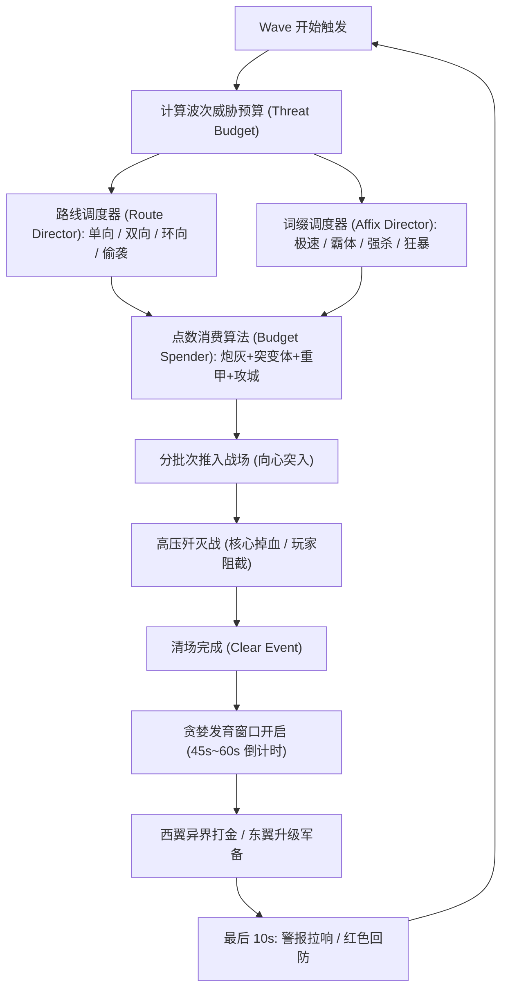
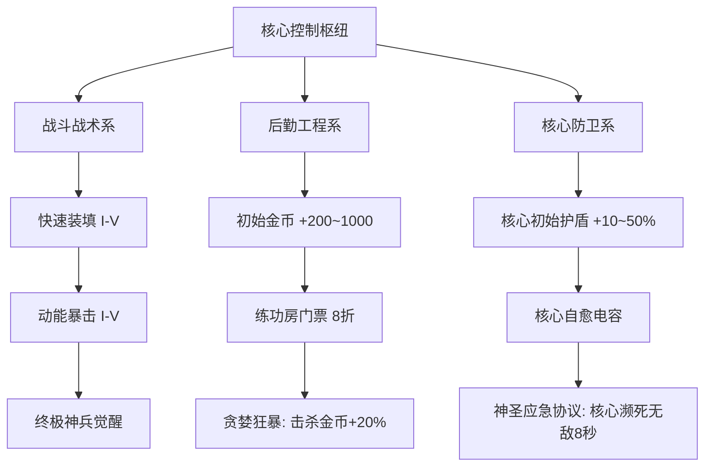

# 《零界防线：核心守卫》（Last Horizon: Core Protocol）
## UEFN 商业级游戏设计策划案 (GDD) 与叙事剧本

---

### 文档信息
* **项目代号**：GHYDN（守卫雅典娜现代化重构项目）
* **游戏公开发布名**：《零界防线：核心守卫》（英文：*Last Horizon: Core Protocol*）
* **平台**：Fortnite UEFN（全平台：PC / Console / Mobile）
* **游戏类型**：1~4人 合作PVE动作防守（Zero Build Co-op Action Defense）
* **推荐单局时长**：30 ~ 45 分钟（30波次，每 6 波一个大周期）
* **商业目标**：契合 Epic Games Engagement Payouts 收益算法（超长单局停留 + 高次留/七留 + 短视频破圈裂变）

---

## 目录
1. [项目定位与核心设计哲学](#一项目定位与核心设计哲学)
2. [世界观与剧情脚本（叙事剧本）](#二世界观与剧情脚本叙事剧本)
3. [关卡动线与空间拓扑规划](#三关卡动线与空间拓扑规划)
4. [Wave Director 导演系统与 30 波心流编排](#四wave-director-导演系统与-30-波心流编排)
5. [武器装备与局内合成体系](#五武器装备与局内合成体系)
6. [数值模型与动态平衡公式](#六数值模型与动态平衡公式)
7. [局外永久成长体系（Persistence API）](#七局外永久成长体系persistence-api)
8. [技术实现架构与 Verse 规范](#八技术实现架构与-verse-规范)
9. [避坑准则与性能预算约束](#九避坑准则与性能预算约束)

---

## 一、项目定位与核心设计哲学

### 1.1 核心驱动：四大阶段心流闭环（防守 ➔ 清算 ➔ 贪婪 ➔ 回防）
传统魔兽争霸《守护雅典娜》的灵魂绝非机械单调的“每隔 N 秒出几只怪”，而是根植于**张弛有度的波次驱动与高压释放后的【贪婪窗口 (Greed Window)】**：

```
     【单波心流紧张度曲线】
 紧张度
   ▲
   │        [第N波怪潮突入]
   │          █████████ 
   │         █         █ 
   │        █           █ 
   │       █             █   [全清瞬间：极大成就感与解脱]
   │      █               █  
   │     █                 ▼ 
   │    █                   [贪婪窗口：倒计时心跳博弈]
   │   █                     "还剩 45 秒！去不去异界刷钱？"
   └──█──────────────────────████████████████──────────► 时间
     【1.高压防守】           【2.战场清算】 【3.贪婪发育】 【4.警报回防】
```

1. **第一阶段：高压防守（High-Pressure Defense）**：正面战场的怪物浩浩荡荡涌入，核心血条在倒计时中脆弱不堪，团队必须交出全部火力、技能与身法进行迎击拦截。
2. **第二阶段：战场清算（Threat Eradication）**：消灭最后一只攻城巨兽，全屏警报解除，跳出波次击破特效与大量金币奖励，带来极强的心流释放。
3. **第三阶段：贪婪发育（Greed & Growth Window - 45s~60s）**：
   - 绝非无所事事的“垃圾等待时间”，而是最刺激的资源决策期。
   - 玩家面临经典博弈：*“去西翼折跃门刷 45 秒高收益打金房？还是去东翼工坊升级 T2/T3 武器？或是花费重金纳米维修核心？”*
4. **第四阶段：警报回防（Alarm & Recall Window - 10s）**：
   - 下一波来临前 10 秒，全图警报鸣响、红光闪烁，出怪方向全屏广播。
   - 异界打金房内的特工必须立刻踩传送阵或通过紧急通道狂奔回救，TPS 视角下看不见基地的视距阻隔将“回防恐慌”推向极致。

### 1.2 商业化与算法契合度
* **分均留存时间（Playtime）**：通过“战斗 ➔ 发育 ➔ 战斗”的紧凑心流，杜绝垃圾等待时间，将单局有效留存锁死在 35~45 分钟的高价值收益区间。
* **次日/七日留存（Retention）**：利用 UEFN `Persistence API` 打造局外永久科技矩阵，通关或失败均有正向积累。
* **短视频裂变（Viral UA）**：高波次全屏弹幕、极光粒子爆发与“核心还剩 1% 血量时极限绝杀”的戏剧张力，天生具备 TikTok、YouTube Shorts 传播基因。

### 1.3 经典魔兽争霸《守护雅典娜》设计机制传承对照表

| 经典魔兽《守护雅典娜》机制 | 传统核心乐趣/痛点 | 《零界防线》UEFN 现代化重构 (TPS) |
| :--- | :--- | :--- |
| **四向出怪 + 强制向心进攻 (Attack-Move to Athena)** | 怪物从四个方向刷新，直线扑向雅典娜。传统平地刷怪极易拉脱或呆立不走。 | • 四向建立距离核心 2,800m 的**攻城怪潮营地**（东/南/西/北）；<br>• 在中心核心部署 **Objective 目标诱导装置**，激活怪物原生攻城行为树；<br>• 形成四路大军浩浩荡荡向中心合围收缩的史诗压迫感。 |
| **四方守卫出生站位 (4 Guard Posts)** | 英雄出生在雅典娜身旁（东、南、西、北各站一人），象征四大守卫神兽，一人看守一路。 | • 4 个特工出生平台环绕核心布置（东、南、西、北半径 500m）；<br>• 玩家视野正对各自防线走廊与前方的发光全息任务告示板，出场即明确防区。 |
| **开局新手武器与无限备弹** | 玩家进图必须第一时间有输出手段，绝不能赤手空拳看怪物攻城。 | • 部署 **Team Settings & Inventory** + 专属武器架，进图自动装备稀有突击步枪与霰弹枪；<br>• 岛屿全局锁定 **Zero Build (零建造)** 与 **无限备弹**，专注射击走位。 |
| **升级雅典娜护甲与生命恢复** | 玩家有钱后不仅强化自己，更重要是去雅典娜神殿升级防御与自愈。 | • 核心圣域设立【纳米维修】(+5000 HP) 与【护盾扩容】(+2000 Shield) 终端；<br>• 核心头顶设立 3D 浮空全息血条/护盾指示牌，升级即时反馈。 |
| **贪婪打金练功房 vs 紧急回城救场** | 进练功房刷怪收益极高，但主家被偷极快，必须在倒计时或警报拉响时瞬间秒传回救。 | • 西北翼专属折跃门 + 45 秒协程强制限时 (`race` 状态机)；<br>• 核心生命值低于 15% 时全图触发红色绝境警报并开启紧急回援撤离直通门。 |
| **波次预算与复合特殊词缀** | 传统经典版本拥有极速、霸体、强杀、偷袭等词条怪，不单是纯数值堆砌。 | • 引入 **Wave Director 威胁预算模型** 与 **7 大特殊词缀**，每波怪物由 AI 导演基于威胁点数动态购买组合。 |

---

## 二、世界观与剧情脚本（叙事剧本）

### 2.1 世界观背景
公元 2184 年，地表空间出现未知的维度裂隙——“虚空之渊（The Void Rift）”。异界生物与硅基感染体如同瘟疫般吞噬各大大陆。
人类最后的生还者在大裂谷建立了一座坚固要塞，以代号**“零号矩阵（Matrix Zero / 能量核心）”**的人工奇点反应堆为能源，维持着保护全人类避难所的高维电磁穹顶。

能量核心不仅在供能，还在进行着一项长达 30 阶段的“虚空编码净化解析”。一旦核心被摧毁，防线即刻崩塌；若完成 30 阶段解析，净化脉冲将彻底封印虚空之渊。

### 2.2 核心角色与声优台词设定
* **战术指挥 AI ——“赫拉”（HERA）**：冷静、精准、带有一丝毒舌的要塞主控人工智能（负责全局语音、波次倒计时、警报广播）。
* **玩家小队**：代号“幽灵游侠（Ghost Rangers）”的机动特工，身负超导动能装甲。

### 2.3 剧本流程与全局台词演出表

| 阶段 | 波次 | 剧情事件 / 广播台词 | 战场氛围表现 |
| :--- | :--- | :--- | :--- |
| **序幕** | 开局 0s | **HERA**：*“特工接入完毕。警告：检测到虚空引力波暴涨，第一波跳虫群将在 30 秒后破门！拔出你们的武器，誓死捍卫零号矩阵！”* | 阳光斜照，警报黄光闪烁，武器终端自动解锁基础蓝枪 |
| **周期 1** | Wave 1~6 | **HERA (W3)**：*“防线初稳。练功房折跃门已解锁，想要更强的火力？自己去里面抢，但记住——别死在贪婪里！”*<br>**HERA (W6)**：*“领主级震颤！北方裂隙破裂，撕裂者降临！”* | 白昼转为阴云，四向出怪口冒出紫色暗物质烟雾，W6 领主登场 |
| **周期 2** | Wave 7~12 | **HERA (W9)**：*“高能警报！东翼哨位受到侧翼隐秘突袭！怪潮具有【极速】与【偷袭】词缀！”*<br>**HERA (W12)**：*“狂暴重装巨兽破门！护盾无法吸收重击，拉开距离！”* | 暴雨倾盆，天空中出现巨型虚空裂隙球体，雷电交加 |
| **转折狂欢** | Wave 15 | **HERA**：*“拦截到虚空补给运输艇！全员注意：30秒内击毁它们，所有打捞物资归你们私有！”* | 欢快的警报声，金色机械鸟与宝箱怪全图飞奔，满地金币 |
| **周期 3** | Wave 13~18 | **HERA (W16)**：*“攻城穿透者出现！它们完全无视你们的火力，锁死核心狂冲！用肉身去拦住它们！”* | 地面剧烈震颤，天空裂开猩红血色，全屏重金属战歌渐起 |
| **周期 4** | Wave 19~24 | **HERA (W24)**：*“第四领主【暗影虚空龙】降临！全图电磁压制，核心自愈被阻断！”* | 全图电磁干扰雪花屏，防线建筑残破，火光冲天 |
| **周期 5 (终章)** | Wave 25~30 | **虚空主宰 (深沉混音)**：*“微不足道的火种……终将归于寂灭。”*<br>**HERA (W30)**：*“解析进度 99%！特工们，把所有的弹药倾泻在它脸上！为了人类！”* | 巨型 Boss 降临中场，天空雷暴狂涌，神装特效全面交织 |
| **胜利尾声** | 通关 | **HERA**：*“净化脉冲已激活……裂隙闭合。干得漂亮，游侠们。今晚，地表重归人类。”* | 刺目的白色净化光芒席卷全图，黎明破晓，全屏慢动作结算 |

---

## 三、关卡动线与空间拓扑规划

```
                                  [ 北向攻城裂隙营地 (0, 2800) ]
                                     3x 出怪阵 + 领主生成点
                                               │
                                               ▼ (怪潮向南推进)
                                               │
                                      [ 北哨位 (0, 500) ]
                                 玩家1出生台 + 武器台 + 全息指引牌
                                               │
                                               ▼
                 ┌───────────────────────────────────────────────────────────┐
                 │               中央零号矩阵圣域 (0, 0, 1155)                │
                 │                                                           │
[ 西向攻城裂隙 ]  │ [ 西翼：折跃枢纽 ]          [ 能量核心 ]     [ 东翼：军备工坊 ]   │ [ 东向攻城裂隙 ]
  (-2800, 0)     │ ├─ 45s异界打金门: (-350, 350)├─ 30k HP/10k盾 ├─ 武器升阶: (350, 350) │    (2800, 0)
  3x 出怪阵 ───▶ │ └─ 避难所回传点: (-250, 250) ├─ 全息任务板   ├─ 纳米维修: (420, 280) │ ◀─── 3x 出怪阵
 (怪潮向东扑入)   │                              ├─ 目标诱导器   └─ 护盾扩容: (280, 420) │  (怪潮向西扑入)
                 │ [ 西哨位 (-500, 0) ]         └─ 生物管理器   [ 东哨位 (500, 0) ]    │
                 │ 玩家4出生台 + 武器台 + 指引牌                玩家3出生台 + 武器台 + 指引牌 │
                 │                                                           │
                 │                              ▲                            │
                 └──────────────────────────────┼────────────────────────────┘
                                                │
                                       [ 南哨位 (0, -500) ]
                                  玩家2出生台 + 武器台 + 全息指引牌
                                                ▲
                                                │ (怪潮向北推进)
                                                │
                                  [ 南向攻城裂隙营地 (0, -2800) ]
                                     3x 出怪阵 + 淘金怪刷新器

                                                                    [ 隔离异界 (15000, 15000) ]
                                                                       [ 45s 限时打金狂欢房 ]
                                                                       ├─ 到达传送阵
                                                                       ├─ 紧急撤离交互点
                                                                       └─ 2x 狂暴金币野怪刷新器
```

### 3.1 空间区域尺寸与规格参数
1. **中央核心圣域（$80\text{m} \times 80\text{m}$ 安全核心区，标高 $Z = 1155$）**：
   * **中心 (0, 0)**：零号矩阵核心（悬浮发光聚变晶体，绑定 `core_health_device`，30,000 HP + 10,000 护盾）。
   * **目标诱导器 (0, 0)**：部署 **Objective Device**，向全图广播强仇恨信号，强制所有生物 AI 向心聚拢攻城。
   * **东北翼 (300~450, 300~450)**：武器军备工坊（武器升阶按钮、核心纳米维修按钮、护盾扩容按钮、T1/T2/T3 阶梯装备发放机）。
   * **西北翼 (-300~-450, 300~450)**：折跃枢纽（45 秒限时打金房入口按钮、折跃传送阵、主城回传点）。
   * **四向哨位特工出生点**：
     * **北哨位 (0, 500)**：特工 1，面朝正北（Yaw 90°），正对北向裂隙，配发主战突击步枪与全息指引牌。
     * **南哨位 (0, -500)**：特工 2，面朝正南（Yaw 270°），正对南向裂隙，配发主战突击步枪与全息指引牌。
     * **东哨位 (500, 0)**：特工 3，面朝正东（Yaw 0°），正对东向裂隙，配发主战突击步枪与全息指引牌。
     * **西哨位 (-500, 0)**：特工 4，面朝正西（Yaw 180°），正对西向裂隙，配发主战突击步枪与全息指引牌。
2. **四向进攻大走廊（出怪线，长约 2800 米）**：
   * **出怪裂隙营地**：分别位于正北 `(0, 2800)`、正南 `(0, -2800)`、正东 `(2800, 0)`、正西 `(-2800, 0)`。
   * **每向出怪阵列**：配置 3 路并联 `creature_spawner_device`，面朝中心核心发射怪潮。
3. **开局军备与全局规则保障**：
   * **Team Settings & Inventory**：开局自动装备突击步枪与近战喷子，开启无限后备弹药。
   * **IslandSettings**：锁定 **Zero Build (零建造)**，杜绝盖违建卡怪，专注 TPS 身法射击与火力割草。
   * **全息指引告示牌 (Holographic Billboards)**：中心与四向出生点均部署高亮夜光告示牌，指明各自防区与功能区方位。
4. **隔离资源区（练功房）**：
   * 位于主地图外极远坐标 `(15000, 15000, 1155)`，彻底物理隔离战场视距与音频碰撞。
   * 房内配置持续刷新高额金币的特殊跳虫，中央设有提前撤退按钮与 45 秒强制遣返机制。

---

## 四、Wave Director 导演系统与 30 波心流编排

本作为打破传统塔防“固定死板刷怪”导致的垃圾时间，引入完整的 **Wave Director（波次导演系统）**。系统基于**“波次威胁预算 (Threat Budget) + 路线突变 + 复合特殊词缀 + 6波周期律”**四维动态生成每一波敌人。

### 4.1 核心架构流转图



---

### 4.2 威胁预算模型（Threat Budget Formula）

每一波并非生硬地硬编码生成怪数，而是由波次导演分配总威胁点数：

$$\text{ThreatBudget}_W = \left[ B_{\text{base}} + (W - 1) \times \Delta B + (W // 6) \times \text{BossSurge} \right] \times S_p$$

* $B_{\text{base}} = 20$（第 1 波基础点数）；
* $\Delta B = 8$（每波增长点数）；
* $\text{BossSurge} = 50$（每 6 波 Boss 周期额外点数爆发）；
* $S_p$ 为玩家人数动态缩放（单人 0.6x，双人 0.85x，三人 1.0x，四人 1.25x）。

#### 敌对兵种威胁成本表（Cost by Archetype）：
| 兵种代码 | 兵种名称 | 威胁点数 (Cost) | 行为定位与机制 | 战术反制要求 |
| :--- | :--- | :---: | :--- | :--- |
| **HUSK** | 基础感染者 (Husk) | **1** | 填线炮灰，基础近战，数量众多 | 步枪扫射、AOE 电弧溅射 |
| **RUNNER** | 迅捷猎犬 (Runner) | **3** | **极速**：移速 +100%，无视前排直接冲脸/咬核心 | 贴脸霰弹击退、优先狙杀 |
| **BRUTE** | 重甲掷弹怪 (Brute) | **8** | **霸体**：高生命、高削韧，远程投掷高爆暗物质 | 弱点集火、拉扯放风筝 |
| **INFILTRATOR**| 暗影潜伏者 (Infiltrator) | **12** | **偷袭**：在基地侧翼折跃门或后背刷新，打破防线 | 听声辨位、后背防守 |
| **SIEGE** | 攻城行者 (Siege Mech) | **15** | **强杀**：完全无视玩家仇恨，锁死核心发射激光炮 | 肉身阻挡、爆发技能秒杀 |
| **GOLD_BIRD** | 淘金信使 (Gold Carrier)| **-10** (奖励)| 无攻击力，高速逃窜，击破全员获得 800 金币 | 贪婪击杀、高收益追击 |
| **BOSS** | 灾厄领主 (World Boss) | **50** | 周期性大 Boss，全屏大招、召唤狂暴护卫 | 团队分工、控制链打断 |

---

### 4.3 7 大特殊词缀系统（Special Affix System）

从第二周期（第 7 波）开始，波次导演将为怪潮注入特殊词缀，并在中后期组合出致命的**复合词缀**：

```
                                  [ 7 大核心词缀 ]
        ┌─────────────┬─────────────┼─────────────┬─────────────┐
        ▼             ▼             ▼             ▼             ▼
   【极速】        【霸体】       【强杀】       【偷袭】       【狂暴】
  移速+100%      免疫击退控制   锁死拆家无视仇恨  侧翼/后方突入   残血伤害翻倍
 (Sprinter)     (Unstoppable)    (Siege)       (Flank)       (Enraged)
                      │                           │
                      ▼                           ▼
                 【霜冻/迟缓】                  【自爆】
                 靠近玩家减速50%               死后核爆伤核心
                  (Frost Aura)                 (Volatile)
```

#### 词缀机制与打法破局：
1. **【极速 (Sprinter)】**：怪物冲锋移速翻倍，2800m 走廊 12 秒破门。*打法*：前压减速、霰弹枪贴脸拦截。
2. **【霸体 (Unstoppable)】**：免疫硬直、击飞与击退。*打法*：无法靠控场拉扯，必须交高爆发 DPS 融化。
3. **【强杀 (Siege / Aggro-Immune)】**：**《守护雅典娜》最经典设计**。怪物 AI 被锁死在 Objective Device 核心上，玩家就算贴脸开枪它也绝不回头打玩家。*打法*：无法通过拉怪解围，必须用身体肉身卡位或集火强秒。
4. **【偷袭 (Flank / Ambush)】**：出怪点突变！怪物不从 2800m 大道来，而是**直接在圣域西翼（折跃门）或东北工坊近距离撕裂裂隙刷新**！*打法*：彻底粉碎“堵正门”阵型，逼迫全员回防后背。
5. **【狂暴 (Enraged)】**：生命值降至 40% 以下时，体型放大 1.2 倍，攻击速度与伤害暴涨 100%。*打法*：严禁慢条斯理磨血，必须保留大招斩杀。
6. **【自爆 (Volatile)】**：死亡 1.5 秒后剧烈自爆，对半径 8 米内的玩家和核心造成巨额伤害。*打法*：严禁在核心脚下击杀，必须在走廊外围远距离引爆。
7. **【霜冻 (Frost Aura)】**：周围产生减速冰冻力场，玩家靠近移速下降 50%。*打法*：拉开距离远距离风筝。

---

### 4.4 路线动态突变机制（Route Mutation）

防守走廊绝非一成不变：
* **单向突破（Phase 1: W1~W3）**：正北或正南单向进军，让玩家熟悉弹道与站位。
* **双向钳形夹击（Phase 2: W4~W8）**：正北 + 正南对穿，或正东 + 正西夹击，考验双人守备默契。
* **三路围剿（Phase 3: W9~W15）**：随机封锁一路，其余三路以不同速度同时推进。
* **四方全域合围（Phase 4: W16~W30）**：东、南、西、北四路大营全开，铺天盖地的怪潮向心收缩。
* **暗影突袭（突发事件）**：在 Boss 战或大波次进行中，侧翼突然开启传送裂隙偷袭。

---

### 4.5 30 波关卡详细参数规划表（每 6 波一周期律）

结构化大节奏：
$$1 \to 2 \to 3 \to 4 \to 5 \to \mathbf{[6\text{ Boss}]} \to \dots \to 25 \to 26 \to 27 \to 28 \to 29 \to \mathbf{[30\text{ Final Boss}]}$$

| 周期 | 波次 | 威胁预算 | 进攻路线 | 核心兵种组合 | 特殊词缀 | 团队战术与破局策略 | 装备门槛 |
| :---: | :---: | :---: | :--- | :--- | :---: | :--- | :--- |
| **序章** | **W1** | 20 | 北向单线 | 20x 基础感染者 (Husk) | 无 | 熟悉枪感，单点爆头 | 蓝色初始 AR |
| | **W2** | 28 | 南向单线 | 22x 感染者 + 2x 迅捷犬 | 无 | 测试近身霰弹枪切枪手感 | 蓝色初始 AR |
| | **W3** | 36 | 东西对进 | 24x 感染者 + 4x 迅捷犬 | 【极速】 | 西翼折跃门解锁！一人守家一人刷打金房 | 强化+1 |
| | **W4** | 44 | 南北夹击 | 20x 感染者 + 8x 迅捷犬 | 无 | 两人各守南北大道 | 紫色 AR |
| | **W5** | 52 | 东西夹击 | 20x 感染者 + 4x 重甲怪 | 【霸体】 | 重甲怪正面免伤，打后背弱点 | 紫色满改 |
| **C1 决战** | **W6 (Boss)**| **110** | **北向中路** | **1x 撕裂者领主** + 10x 狂暴犬 + 2x 重甲 | **【领主+霸体】** | **首个周期 Boss**！两人拉仇恨两人爆头输出 | **首把 T2 武器** |
| **进阶** | **W7 (Bonus)**| 60 | 四向扩散 | 6x 黄金信使 + 10x 感染者 | 无 | **首轮淘金狂欢**！全图疯狂打金 800+ | 任意 |
| | **W8** | 68 | 三向合围 | 30x 感染者 + 6x 迅捷 + 2x 重甲 | 【极速】 | 三路同时逼近，火力交叉支援 | T2 基础 |
| | **W9** | 76 | **侧翼偷袭** | 20x 潜伏者 + 10x 迅捷犬 | **【偷袭 + 极速】** | **警报：西翼折跃门失守！** 掉头守后背 | T2 强化+2 |
| | **W10** | 84 | 四向合围 | 24x 感染者 + 4x 攻城穿透者 | **【强杀】** | 攻城怪无视玩家！肉身阻挡，防止拆核心 | T2 强化+3 |
| | **W11** | 92 | 南北夹击 | 20x 自爆蛛 + 4x 重甲怪 | **【自爆】** | 严禁贴脸打自爆怪，中远距离引爆 | T2 满改 |
| **C2 决战** | **W12 (Boss)**| **150** | **南向中路** | **1x 暴食巨兽·格鲁特** + 4x 攻城怪 | **【强杀 + 霸体】** | **第二周期 Boss**！带攻城护卫，核心濒死救场 | **合成首把 T3 神器** |
| **高压** | **W13** | 100 | 四向合围 | 30x 感染者 + 10x 迅捷犬 | **【霸体 + 狂暴】** | 残血怪物暴走，交大招迅速清屏 | T3 神器单把 |
| | **W14** | 108 | 东西对进 | 20x 潜伏者 + 4x 攻城穿透者 | **【偷袭 + 强杀】** | 极度凶险！偷袭怪直接在基地内拆核心 | 全员 T3 入门 |
| | **W15 (Bonus)**| 80 | 全图乱窜 | 12x 黄金飞艇 + 宝箱怪 | 无 | **中场大狂欢**！掉落全场升级万金 | 任意 |
| | **W16** | 116 | 四向合围 | 40x 感染者 + 8x 攻城穿透者 | **【强杀 + 极速】** | 攻城怪极速冲锋，核心血量极速告急 | T3 强化+2 |
| | **W17** | 124 | 南北夹击 | 20x 寒霜掷弹怪 + 10x 重甲 | **【霜冻 + 霸体】** | 全图范围减速力场，身法滑铲规避 | T3 强化+3 |
| **C3 决战** | **W18 (Boss)**| **190** | **东向中路** | **1x 暗影织网者** + 6x 潜伏者 + 4x 攻城 | **【偷袭 + 强杀 + 霸体】**| **第三周期 Boss**！基地内直接爆卵召唤 | **双人 T3 满强化** |
| **绝境** | **W19** | 132 | 四向合围 | 40x 自爆怪 + 10x 迅捷犬 | **【极速 + 自爆】** | 自爆怪狂冲，一旦进核心直接瞬间蒸发 | T3 满神装 |
| | **W20** | 140 | 东西对进 | 20x 重甲 + 6x 攻城穿透者 | **【强杀 + 霸体】** | 极高破甲要求，集火背部弱点 | T3 满神装 |
| | **W21** | 148 | **圣域中心** | 30x 潜伏者 + 10x 自爆怪 | **【全图偷袭】** | 空间全面撕裂！怪直接刷在核心四周！ | T3 满神装 |
| | **W22** | 156 | 四向合围 | 50x 感染者 + 8x 攻城怪 | **【狂暴 + 强杀】** | 怪物死咬核心不放，全员交大招秒杀 | 纳米维修核心 |
| | **W23** | 164 | 南北夹击 | 30x 寒霜怪 + 10x 重甲 | **【霜冻 + 霸体 + 狂暴】**| 极强压制力，全队保持移动，严禁站桩 | 全员满神装 |
| **C4 决战** | **W24 (Boss)**| **230** | **北向裂隙** | **1x 虚空吞噬龙** + 10x 迅捷 + 4x 攻城 | **【全词缀领主】** | **第四周期 Boss**！全屏喷吐重力塌缩弹 | **全员终极神魔异宝** |
| **终焉** | **W25 (Bonus)**| 100 | 全图 | 20x 终极黄金魔方 | 无 | **最后一轮抢修狂欢**，金币全部买核心护盾 | - |
| | **W26** | 180 | 四向合围 | 40x 极速攻城怪 | **【强杀 + 极速】** | 40只攻城怪全速冲家，容错率为 0 | 核心护盾满级 |
| | **W27** | 188 | 四向合围 | 30x 潜伏者 + 20x 重甲 | **【偷袭 + 霸体】** | 基地内外两开花，极度考验多任务处理 | 全技能交替 |
| | **W28** | 196 | 四向合围 | 50x 感染者 + 10x 自爆 + 6x 攻城 | **【自爆 + 强杀】** | 战火连天，全屏弹幕割草 | 纳米维修待命 |
| | **W29** | 204 | 四向合围 | 湮灭混编全军团 (40x 极速/霸体/强杀) | **【全词缀大军】** | 最后一波杂兵总攻，全力顶住！ | 全员终极状态 |
| **最终裁决** | **W30 (Final)**| **320** | **圣域上空** | **终焉领主·零界主宰 (The Void Prime)** | **【三阶段神话领主】** | **最终决战**：分身、全屏秒杀充能、雷暴轰炸 | 拯救零号矩阵！ |

---

## 五、武器装备与局内合成体系

### 5.1 阶梯进阶树（Tier Progression）
```
[T1 基础武器] ──(强化+1~+5)──▶ [T2 进阶武器] ──(融入Boss核心素材)──▶ [T3 终极神魔异宝]
（蓝/紫色常规模拟枪械）       （金色科幻能量枪/附带AOE）          （全屏特效质变武器）
```

### 5.2 核心神兵矩阵与被动机制

| 武器名 | 武器定位 | 基础手感 | 核心质变被动 (Verse 驱动) | 视觉/音效反馈 |
| :--- | :--- | :--- | :--- | :--- |
| **雷神之怒 (Mjolnir AR)** | 链式连击步枪 | 高射速中口径 | 每次命中触发**“连环电弧”**，在 12 米内最多跳跃 5 个目标，造成 40% 溅射电伤。 | 刺目的蓝白色高压闪电粒子，伴随清脆雷鸣 |
| **地狱火重炮 (Hellfire Heavy)** | 战术高爆霰弹 | 4发泵动近战 | 开火喷射铝热燃烧弹，在着火区域留下**“烈焰风暴”**，持续灼烧造成减速与破甲。 | 金红色熔岩地面粒子，怪物身上附着火焰 |
| **虚空挽歌 (Singularity Bow)** | 战术重弓 | 蓄力贯穿射击 | 满蓄力箭矢在命中终点生成**“微型黑洞”**，聚拢周围 8 米内所有非霸体怪物并引爆。 | 空间扭曲着色器特效，深紫色重力坍缩冲击波 |
| **风暴使者之刃 (Zephyr Blade)** | 近战动能大剑 | 挥砍与重砸 | 右键消耗能量释放**“环形剑气旋风”**，击退所有怪群并立刻回满自身 25% 护盾。 | 炫目的风刃拖尾与地面碎石炸裂 |

---

## 六、数值模型与动态平衡公式

### 6.1 怪物成长指数曲线
为兼顾前期爽快割草与中后期高压博弈，采用复利增长模型：

$$\text{HP}_W = 200 \times (1.22)^{W-1} \times S_p$$
$$\text{ATK}_W = 15 \times (1.16)^{W-1} \times S_p$$

其中 $W$ 为当前波数（$W \in [1, 30]$），$S_p$ 为**玩家人数动态缩放系数**（单人 0.55x，双人 0.80x，三人 1.00x，四人 1.25x）。

### 6.2 核心防御容错公式
* **核心基础生命**：$30,000$ 点。
* **核心基础护盾**：$10,000$ 点（脱战 10 秒后以 500点/秒 恢复）。
* **无人防守崩溃临界**：在任意标准波次中，若一整条走廊的怪潮（约 8~12 只）完全接触核心：
  $$\text{TTD} (\text{Time to Death}) = \frac{30,000}{\sum \text{ATK}_W \times \text{AttackSpeed}} \approx 14 \sim 18\text{秒}$$
  *此数值严格锁死在“练功房玩家看见红光警报后，有 10 秒左右心理决策期，传送回城需 2 秒，落地开大救场需 3 秒”的黄金救场时间窗内。*

---

## 七、局外永久成长体系（Persistence API）

### 7.1 矩阵点数（Matrix Points）结算机制
玩家无论通关还是守家失败，都会根据表现获得永久资产：
$$\text{Matrix Points} = (\text{Cleared Waves} \times 10) + (\text{Elite Kills} \times 5) + (\text{Victory Bonus: } 200)$$

### 7.2 局外天赋矩阵（Matrix Tech Tree）


---

## 八、技术实现架构与 Verse 规范

### 8.1 整体架构设计（模块解耦）
```
                        ┌───────────────────────────────┐
                        │     Game_Manager.verse        │
                        │    (全局主控 / 状态机调度)     │
                        └───────┬───────────────┬───────┘
                                │               │
          ┌─────────────────────┴──┐         ┌──┴──────────────────────┐
          ▼                        ▼         ▼                         ▼
┌──────────────────┐    ┌──────────────────┐ ┌──────────────────┐ ┌──────────────────┐
│ Wave_Controller  │    │   Core_Health    │ │  Teleport_Gate   │ │  Currency_Econ   │
│ (Wave Director/  │    │ (核心血量与警报) │ │ (门票/45s限时)   │ │ (金币/工坊升级)  │
│ 威胁预算/词缀)    │    │                  │ │                  │ │                  │
└──────────────────┘    └──────────────────┘ └──────────────────┘ └──────────────────┘
```

### 8.2 Verse 数据结构规范：Wave Director 核心模型

```verse
# 敌对兵种枚举
enemy_archetype := enum:
    Husk           # 炮灰 (Cost: 1)
    Runner         # 迅捷 (Cost: 3, 极速)
    Brute          # 重甲 (Cost: 8, 霸体)
    Infiltrator    # 潜伏 (Cost: 12, 偷袭)
    SiegeMech      # 攻城 (Cost: 15, 强杀锁核心)
    WorldBoss      # 领主 (Cost: 50)

# 特殊词缀枚举
wave_affix := enum:
    None
    Sprinter       # 极速
    Unstoppable    # 霸体
    Siege          # 强杀 (锁死核心)
    FlankAmbush    # 偷袭 (圣域内部/侧翼近身生成)
    Enraged        # 狂暴 (残血伤害翻倍)
    Volatile       # 自爆 (死后核爆)
    FrostAura      # 霜冻 (减速玩家)

# 出怪路线枚举
incursion_route := enum:
    NorthOnly
    SouthOnly
    EastWestPincer
    NorthSouthPincer
    SurroundAllFour
    SanctuaryAmbush

# 单波配置数据结构
wave_director_config := struct:
    WaveIndex : int
    ThreatBudget : int
    Route : incursion_route
    PrimaryAffix : wave_affix
    SecondaryAffix : wave_affix
    IsBossWave : logic
    GreedWindowSeconds : float = 45.0
```

---

## 九、避坑准则与性能预算约束

### 9.1 版权红线绝对隔离
* **严禁**：使用“雅典娜”、“圣斗士”、“小宇宙”、“天马流星拳”等暴雪、集英社等第三方商标与专有名词。
* **采用**：完全采用科幻/赛博废土叙事（“零号矩阵”、“虚空之渊”、“超导晶体”、“幽灵游侠”）。

### 9.2 内存配额与同屏实体控制（100k 内存上限）
Fortnite 对活动 NPC 数量有严格的服务器性能惩罚（Server Tick Rate）：
1. **怪物同屏上限**：严格控制在 **40~60 只以内**。当场上怪物达到上限时，生成器暂时挂起，直至有怪被消灭再补齐。
2. **拒绝盲目堆怪**：
   * 用**“体型变大 1.5 倍 + 红色高亮边框 + 附带自爆词条”**的精英怪，代替原本需要 20 只小怪才能提供的压迫感。
3. **粒子特效控制**：Niagara 特效的生命周期严格控制在 1.5 秒以内，严禁全图残留粒子造成掉帧。

### 9.3 零长篇教学（前 30 秒流失防范）
* **禁止任何遮挡视线的长篇教程弹窗**。
* 玩家出生在正中央，眼前是醒目的霓虹倒计时浮空字：
  **“30 秒后第一波怪潮撞门！拔出你的枪！”**
* 武器直接放在面前台子上，按 E 拾取即完成武装，指引牌直指防线。

---

> **本设计案即刻生效**，将作为后续 UEFN 关卡搭建、资产导入、Verse 逻辑编写与测试调优的标准依据。
